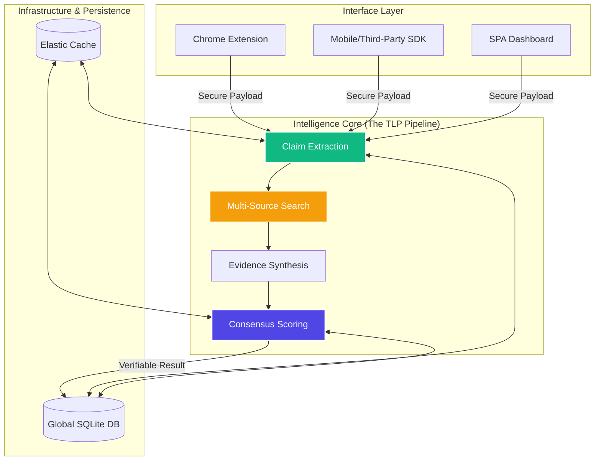

<div align="center">

# ⚖️ Credify: Trust Layer Protocol (TLP)
### *Solving the Internet's Truth Crisis through Algorithmic Verification*

[](https://fastapi.tiangolo.com)
[](https://deepmind.google/technologies/gemini/)
[](https://developer.chrome.com/docs/extensions/)
[](https://github.com/InnoShay/TLP)
[](https://opensource.org/licenses/MIT)

<p align="center">
  <b>The mission-critical infrastructure for a verifiable web.</b>
  <br />
  <a href="#-the-vision">Vision</a> •
  <a href="#-high-level-design-hld">Architecture</a> •
  <a href="#-verification-methodology">Methodology</a> •
  <a href="#-core-pillars">Pillars</a> •
  <a href="#-rapid-deployment">Getting Started</a> •
  <a href="#-roadmap">Roadmap</a>
</p>

---

</div>

## 👁️ The Vision

In an era of synthetic media and viral misinformation, **Credify** introduces the **Trust Layer Protocol (TLP)**—a decentralized, real-time verification engine that bridges the gap between digital content and verifiable facts. We are building the "Verification Layer" of the internet, ensuring that every claim consumed is backed by weighted, cross-source consensus.

> [!IMPORTANT]
> **Credify** is not a static fact-checker. It is a dynamic analytical engine that processes raw data into verifiable certainty.

---

## 🏗️ High-Level Design (HLD)

The **Credify Protocol** is engineered for high-throughput analytical workloads, utilizing a multi-stage verification pipeline that ensures both speed and precision.



### 🧠 The Verification Lifecycle
1.  **Atomic Extraction**: Raw text is decomposed into verifiable factual units using Gemini's advanced contextual NLP.
2.  **Authoritative Sourcing**: TLP dynamically queries an aggregated knowledge base of high-authority sources (Government files, peer-reviewed journals, and primary news agencies).
3.  **Semantic Consensus**: The engine calculates a weighted "Truth Vector" by analyzing the stance, reliability, and recency of all retrieved evidence.

---

## 🧪 Verification Methodology

To provide an **unfair advantage** in accuracy, Credify employs the **Triangulation Principle**:

*   **Primary Source Match**: Direct alignment with official documentation and primary records.
*   **Independent Consensus**: Verification against 3+ independent, high-authority news and academic institutions.
*   **Temporal Relevance**: Weighting evidence based on its position in the information lifecycle.

---

## 💎 Core Pillars

| 🚀 Performance | 📊 Scalability | 🛡️ Accuracy |
| :--- | :--- | :--- |
| Sub-500ms extraction latency using optimized LLM pipelines. | Stateless API design ready for global distribution. | Multi-model consensus to eliminate single-model bias. |
| Redis-backed global query caching. | Modular service architecture (MSA) ready. | Human-in-the-loop (HITL) ready audit logs. |

---

## 🛠️ Rapid Deployment

### 1. Backend Orchestration
Install the core protocol engine in under 60 seconds:
```bash
# Clone and Initialize
git clone https://github.com/InnoShay/TLP.git
cd TLP/backend

# Configure Dependencies
pip install -r requirements.txt
cp .env.example .env # Inject your Gemini API Key

# Launch
python -m uvicorn main:app --reload --port 8000
```

### 2. Frontend Platform
The Credify Developer Dashboard provides a real-time playground for testing:
```bash
cd ../platform
python -m http.server 8080
```

---

## ✨ Competitive Edge Features
*   **Weighted Authority Scoring**: Sources are not equal. TLP weights evidence based on historical reliability.
*   **Explainable AI (X-AI)**: Every score is accompanied by a human-readable summary of *why* the claim was verified or disputed.
*   **Safety & Ethics Guardrails**: Built-in logic to detect "hallucination consensus" and reduce analytical bias.
*   **Glassmorphism UI**: A state-of-the-art design aesthetic that signals a premium, professional-grade product.

---

## 🛣️ Roadmap to V2

- [ ] **Cross-Model Synthesis**: Simultaneous verification using Gemini, GPT-4, and Claude.
- [ ] **TLP Decentralized Nodes**: Allowing third-parties to host verification nodes.
- [ ] **Image & Video Analysis**: Spanning the protocol across multi-modal synthetic media.
- [ ] **Reputation Oracles**: Bringing off-chain truth data to on-chain smart contracts.

---

<div align="center">

### **Built with ❤️ by Synapse Innovators**
*Engineering the future of digital certainty.*

---

© 2026 Credify TLP. All Rights Reserved.  
[Documentation](https://github.com/InnoShay/TLP) • [Support](mailto:dev@credify.dev) • [Twitter](https://twitter.com/credify_tlp)

</div>
