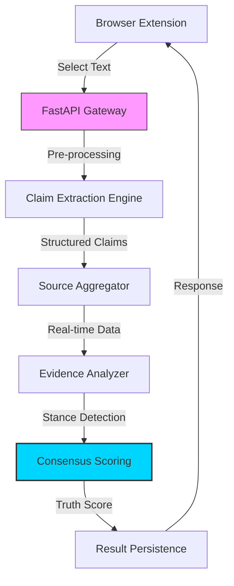

# ⚖️ Truth Layer Protocol (TLP)
### The Infrastructure for a Verifiable Internet

[](https://fastapi.tiangolo.com)
[](https://deepmind.google/technologies/gemini/)
[](https://developer.chrome.com/docs/extensions/)
[](https://sqlite.org)

**Truth Layer Protocol (TLP)** is a decentralizable infrastructure designed to restore trust in digital information. In an era of AI-generated misinformation and deepfakes, TLP provides a real-time, automated verification layer that extracts factual claims, cross-references them against an aggregated knowledge base, and assigns a weighted "Truth Score" using multi-source consensus.

---

## 👁️ The Vision
TLP isn't just a fact-checker; it's the **Truth Operating System**. Our mission is to integrate verification into every interface where information is consumed—from social media feeds to news articles—enabling users to distinguish between verified facts and speculative narratives instantly.

---

## 🏗️ Architecture
The protocol consists of three core components orchestrating a seamless verification lifecycle:



1. **The Extension**: A lightweight, intuitive Chrome extension that identifies claims on any webpage.
2. **The Platform (SPA)**: A developer playground and dashboard to manage API keys, view analytics, and test the engine in real-time.
3. **The Verify Engine**: A sophisticated Python backend leveraging Gemini LLM for high-accuracy claim extraction and evidence synthesis.

---

## 🛠️ Core Technology Stack
- **Engine**: FastAPI (Python 3.10+)
- **Intelligence**: Google Gemini (NLP Extraction & Analysis)
- **Database**: SQLAlchemy + SQLite (Persistence)
- **Caching**: Redis (Performance Optimization)
- **Frontend**: Vanilla JS, Modern CSS (Glassmorphism UI)
- **Extension**: Chrome Manifest V3

---

## 🚀 Getting Started

### Prerequisites
- Python 3.9+
- Gemini API Key
- Redis (Optional, for caching)

### 1. Setup Backend
```bash
git clone https://github.com/InnoShay/TLP.git
cd TLP/backend
pip install -r requirements.txt
cp .env.example .env # Add your Gemini API Key
python -m uvicorn main:app --reload
```

### 2. Setup Platform
The platform is a static SPA. Simply host it or open it:
```bash
cd ../platform
python -m http.server 8080
```
Open `http://localhost:8080` to access the developer dashboard.

### 3. Load Extension
1. Open Chrome and navigate to `chrome://extensions/`.
2. Enable **Developer Mode**.
3. Click "Load unpacked" and select the `extension/` directory.

---

## ✨ Features
- **Real-Time Fact Extraction**: Gemini-powered claim identification from raw text.
- **Aggregated Evidence Search**: Queries multiple sources (News, Wikis, Journals) for consensus.
- **Stance Classification**: Determines if a source *supports*, *contradicts*, or remains *neutral* toward a claim.
- **Developer API**: Secure API keys and usage logging for integrating TLP into third-party apps.
- **Analytics Dashboard**: Monitor verification trends and source reliability.

---

## 🛣️ Roadmap
- [ ] **TLP-SDK**: A JavaScript library for easy integration into web apps.
- [ ] **Decentralized Reputation**: Use blockchain to track source credibility weight over time.
- [ ] **Multi-Model Fusion**: Support for GPT-4 and Claude 3 alongside Gemini.
- [ ] **Deepfake Image Detection**: Extending the protocol to visual media.

---

## 📝 License
Distributed under the MIT License. See `LICENSE` for more information.

---

### Built with ❤️ for Case Western Reserve University & Global Information Integrity.
