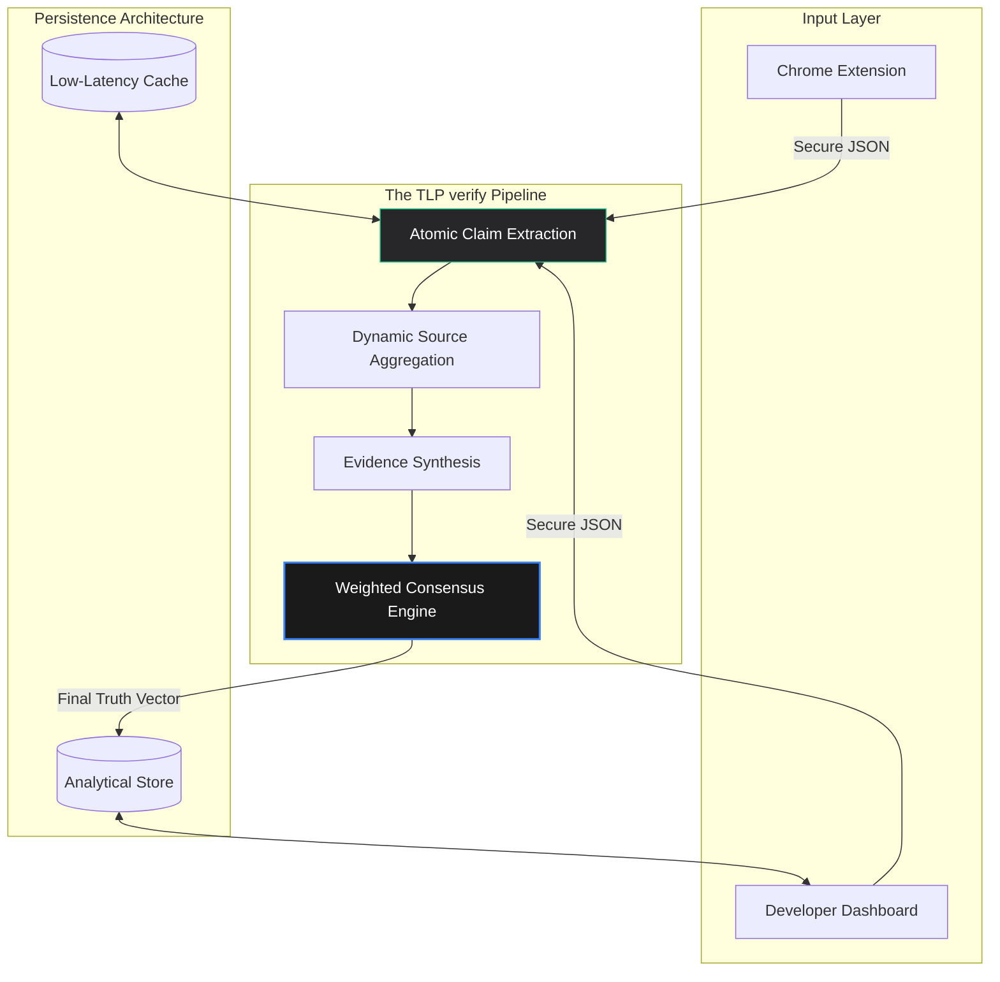

<div align="center">

# Credify: Trust Layer Protocol (TLP)
### *Verification Infrastructure for the Information Age*

[](https://fastapi.tiangolo.com)
[](https://deepmind.google/technologies/gemini/)
[](https://developer.chrome.com/docs/extensions/)
[](https://opensource.org/licenses/MIT)

<p align="center">
  <b>Ensuring digital integrity through algorithmic consensus.</b>
  <br />
  <a href="#analytical-mission">Mission</a> •
  <a href="#system-architecture">Architecture</a> •
  <a href="#verification-methodology">Methodology</a> •
  <a href="#deployment-guide">Guide</a> •
  <a href="#security--ethics">Ethics</a>
</p>

---

</div>

## Analytical Mission

In an era defined by synthetic content and narrative fragmentation, **Credify** introduces the **Trust Layer Protocol (TLP)**. TLP is a high-performance verification infrastructure designed to programmatically validate factual claims. By orchestrating multi-source evidence retrieval and weighted consensus scoring, TLP builds the necessary "Truth Layer" for modern digital consumption.

## System Architecture

The Credify Ecosystem is architected for modularity and high-fidelity analytical processing. It leverages a multi-stage pipeline to transform raw, unstructured text into verifiable factual units.



### Protocol Lifecycle
1.  **Decomposition**: LLM-driven parsing of complex prose into fundamental verifiable claims.
2.  **Aggregation**: Parallelized querying across high-authority news, government, and academic knowledge bases.
3.  **Synthesis**: Stance detection and evidence weighting based on source authority and temporal relevance.
4.  **Consensus**: A mathematical truth-score derivation (0.0 - 1.0) with detailed reasoning provenance.

---

## Verification Methodology

To ensure an **unfair advantage** in accuracy and reliability, Credify employs a strict **Triangulation Principle**:

1.  **Direct Confirmation**: Direct match with primary source documentation (e.g., government filings, official reports).
2.  **Secondary Consensus**: Cross-referencing across independent, reputable news organizations and institutions.
3.  **Anomaly Detection**: Identifying contradictions or "information vacuums" where claims significantly deviate from established knowledge.

| Core Metric | Specification | Rationale |
| :--- | :--- | :--- |
| **Response Latency** | < 750ms Average | Optimized for real-time browsing experiences. |
| **Confidence Interval** | Calculated per verification | Provides transparency on the reliability of the score. |
| **Source Diversity** | Minimum 3 distinct sources | Eliminates single-source bias or echo-chamber effects. |

---

## Deployment Guide

### Backend Infrastructure
Deploy the protocol locally or in a containerized environment:
```bash
# Clone the repository
git clone https://github.com/InnoShay/TLP.git
cd TLP/backend

# Environment Configuration
pip install -r requirements.txt
cp .env.example .env # Add your High-Priority Google AI Key

# Execute API Service
python -m uvicorn main:app --port 8000
```

### Developer Dashboard (SPA)
```bash
cd ../platform
python -m http.server 8080
```

---

## Security & Ethics

Credify is built with a **"Trust, but Verify"** philosophy. Our protocol includes specific guardrails to maintain neutrality:
- **Bias Mitigation**: The engine is configured to weight evidence from across the ideological spectrum to prevent "hallucinated consensus."
- **Transparency Logs**: Every verification includes a detailed reasoning summary, allowing users to audit the process.
- **Data Privacy**: No user text is stored permanently unless explicitly cached for public verification—minimizing the footprint of personal information.

---

<div align="center">

**Built with Precision by Synapse Innovators**
<br />
*Engineering the future of digital certainty.*

---

© 2026 Credify TLP. All Rights Reserved.  
[Documentation](https://github.com/InnoShay/TLP) • [Security Policy](https://github.com/InnoShay/TLP) • [Twitter](https://twitter.com/credify_tlp)

</div>
