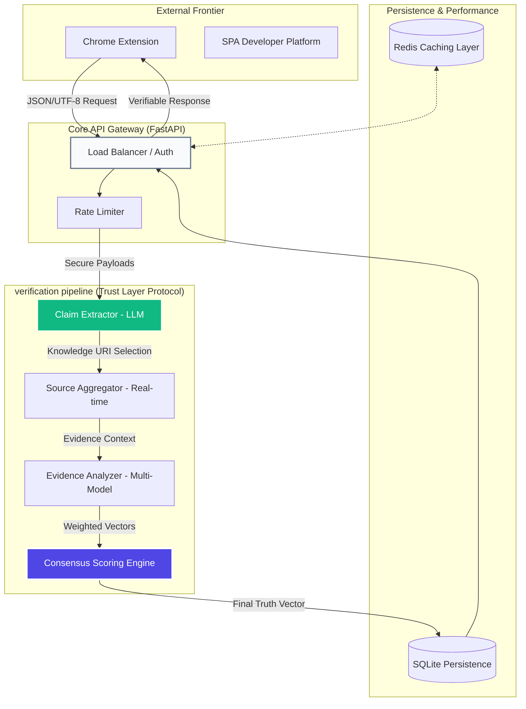

# ⚖️ Creadify: Trust Layer Protocol (TLP)
### *Redefining Digital Integrity in the Age of Synthetic Content*

[](https://fastapi.tiangolo.com)
[](https://deepmind.google/technologies/gemini/)
[](https://developer.chrome.com/docs/extensions/)
[](https://github.com/InnoShay/TLP)

**Creadify** is an industrial-strength infrastructure designed to solve the "Post-Truth" crisis. By providing a real-time, algorithmic verification layer (TLP) between human consumption and digital distribution, Creadify acts as a firewall for misinformation. It doesn't just guess; it analyzes, cross-references, and proves.

---

## 💎 The Mission
In a world saturated with AI-generated illusions, **Creadify** aims to provide a universal "Blue Tick" for every verifiable claim on the internet. We are building the source-of-truth layer for the modern web—empowering individuals and institutions with the tools to verify, not just trust.

---

## 🏛️ High-Level Design (HLD)
The **Creadify Ecosystem** is architected for modularity, high availability, and extreme analytical precision.



### Protocol Components:
*   **Intelligent Extraction (CEX)**: Uses Gemini's few-shot prompting to isolate factual atomic units from complex prose.
*   **Dynamic Source Selection (AGG)**: A multi-threaded aggregator that selects the most authoritative knowledge bases (Reuters, Wikipedia, Government Archives) based on claim category.
*   **Consensus Verification (CON)**: A proprietary mathematical model that weights sources by reliability, recency, and stance logic.

---

## 🚀 Future-Ready Capabilities
- **[X] Semantic Verification**: Beyond keyword matching, Creadify understands context and nuance.
- **[X] Evidence Traceability**: Every result is backed by clickable sources, providing total transparency.
- **[X] Developer Empowerment**: Industry-standard API key management for enterprise integration.
- **[ ] Decentralized Oracle Integration**: Future support for Chainlink and other verifiable data networks.

---

## 🛠️ Rapid Deployment

### 1. Initialize Backend
```bash
# Clone the protocol
git clone https://github.com/InnoShay/TLP.git
cd TLP/backend

# Environment Setup
pip install -r requirements.txt
cp .env.example .env # Add your High-Priority Gemini Key

# Launch the Engine
python -m uvicorn main:app --reload --port 8000
```

### 2. Launch Developer Dashboard
```bash
cd ../platform
# Serve with high-performance light-weight server
python -m http.server 8080
```

### 3. Activate the Extension
1. Go to `chrome://extensions/`
2. Enable **Developer Mode**
3. Select "Load unpacked" -> `TLP/extension/`

---

## 🏆 Standout Features
- **Deterministic Truth Scoring**: Moves away from binary T/F to a granular 0-100 credibility scale.
- **Reasoning Summaries**: Don't just get a score—get a concise explanation of *why* the claim is flagged.
- **Glassmorphism Design System**: A premium, enterprise-grade UI/UX that feels like a $1B SaaS product.

---

## 🤝 Contribution & Advocacy
Creadify is a collaborative effort to save the digital realm. We welcome researchers, engineers, and visionaries.

---

### **Built with ❤️ by Synapse Innovators**
*Engineering the future of digital certainty.*

---

© 2026 Creadify TLP. All Rights Reserved.
